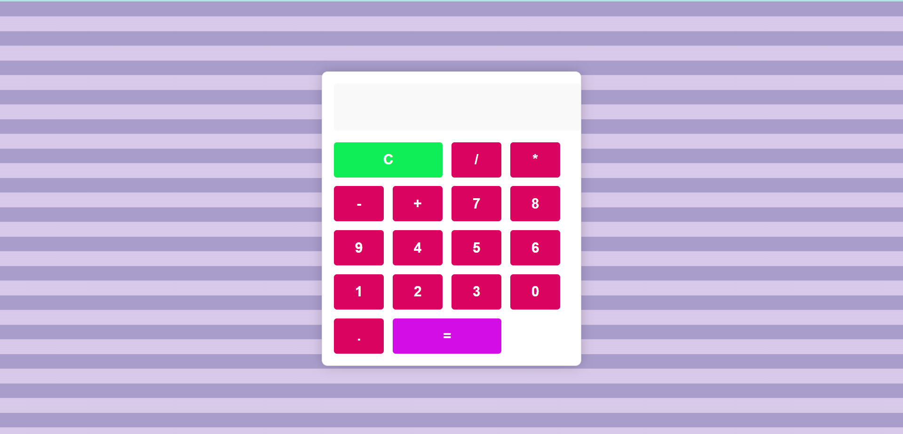

 ## Description

This project is a simple calculator application that allows users to perform basic arithmetic operations such as addition, subtraction, multiplication, and division. Users can input numbers, select operators, and see the calculated result displayed. The application also includes features to clear the display and handle decimal inputs. The logic is implemented using JavaScript to manage the display and operations based on user interactions with the calculator buttons.

# Screenshots

## Features
- Number Input
- Basic Arithmetic Operations (addition, subtraction, multiplication, division)
- Decimal Handling
- Operator Selection
- Display Update
- Calculation Result
- Clear Function

## Author

Sujal Naphade

